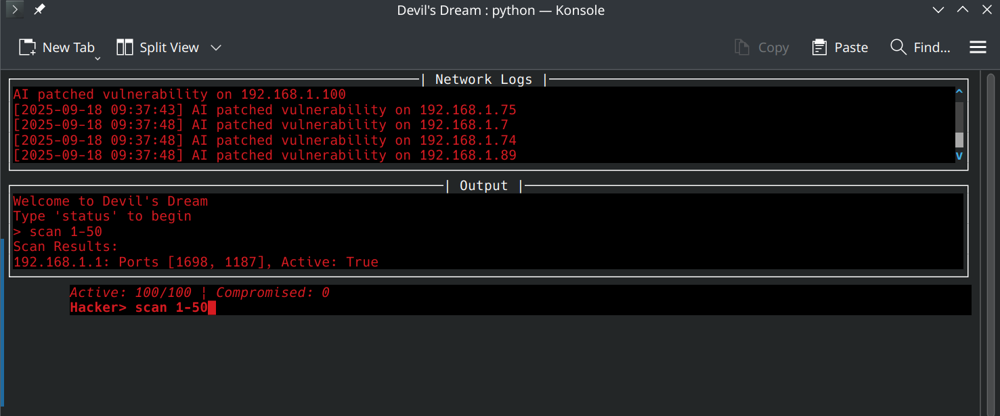
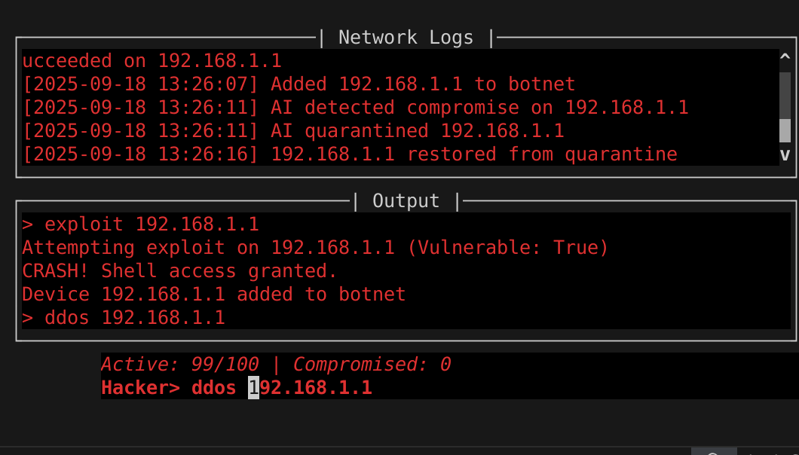

# Devil's Dream Network Emulator



The project "Devil's Dream" is a python based network simulation tool designed for educational and experimental purposes.It creates a virtual network of 100 devices,each with unique ports and vulnerabilities allowing users to practice cybersecurity techniques such as scanning, exploiting and launching attacks, an AI defender dynamically responds to user actions like adding a layer of challenge. The   interface of the terminal provides a devil inspired experience with real time feedback.

## Features

**Virtual Network**:- 100 devices with SSH and HTTP services on unique, non-privileged ports.
**Attack Capabilities**:- scan devices, exploit vulnerabilities (like buffer overflow), launch DDoS attacks and manage a botnet.
**Defender** :- automatically patches vulnerabilities and quarantines compromised devices.
**Interactive ui**:- terminal based interface with autocomplete, live logs and a status bar built with 'prompt_toolkit'.
**Secure Communication**:- Encrypted interactions using the 'cryptography'library.

## Requirements

 **Python**: 3.8 or higher
 **Operating System**: Linux, macOS or Windows
 **Terminal**: it should be minimum size of 7 rows x 40 columns

## Installation
-- Save the project to your device
-- Now open the project folder in some IDE
 
### Create a Virtual Environment :

```bash
python -m venv venv
source venv/bin/activate     # For linux/macOS
venv\Scripts\activate        # Windows
```

### Install Dependencies:
```bash
pip install -r requirements.txt
```

## Usage
 ### Start the Emulator:

```bash
python main.py
```
Note- If the terminal is too small, resize it and retry.

### Interface Layout:

 **Network Logs**: real time event updates (top section).
 **Output**: command results (middle section).
 **Status Bar**: network stats (bottom section).
 **Prompt**: 'hacker>' for command input.

### Available commands :

`scan <range>` -> scans the devices in a given IP range  
like for example:-`scan 1-10`

`connect <ip> <port>` -> connects to a device’s service  
example:-`connect 192.168.1.1 1024`

`exploit <ip> [type]` -> exploits a device (default is `buffer_overflow`)  
example:-`exploit 192.168.1.1`

`ddos <ip>` -> pretend to launch a DDoS attack  
example:-`ddos 192.168.1.2`

`botnet <ip>` -> same as above but with "compromised devices" flair  
example:-`botnet 192.168.1.3`

`status` -> shows you the current network status  
example:-`status`

`exit` -> leaves the emulator like a boss  
example:-`exit`

### For example:

```
hacker> scan 1-5
Scan Results:
192.168.1.1: Ports [1024, 1025], Active: True

hacker> connect 192.168.1.1 1024
Connected to 192.168.1.1:1024. Enter password:
Password> admin123
Login successful

hacker> exploit 192.168.1.1
CRASH! Shell access granted.
```





## Troubleshooting

**"Terminal too small"**:- Increase the terminal size or use a modern terminal emulator.
**Port binding errors**:- verify 'PORT_RANGE' in 'config/settings.py' if uses ports 1024–2023.
**No output**:- Check 'network_events.log' for errors and ensure that the dependencies are installed.
